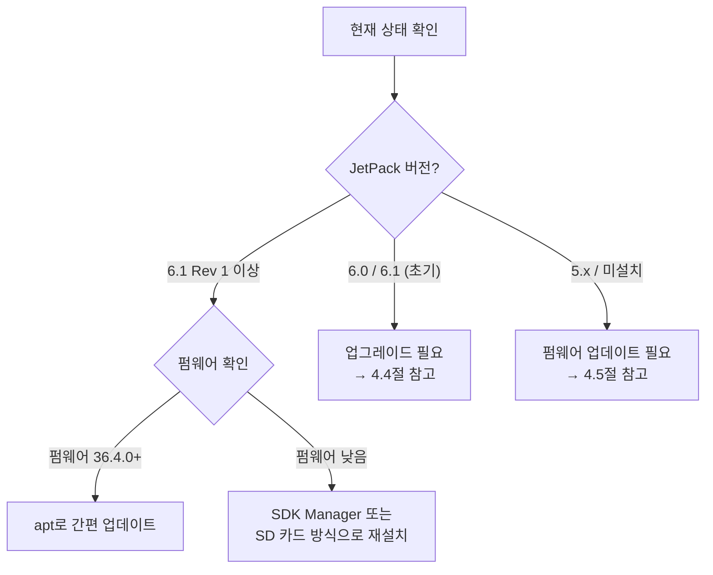

# Jetson Orin Nano Super 완벽 가이드

> **NVIDIA Jetson Orin Nano**는 2023년 출시된 엣지 AI 컴퓨팅 플랫폼입니다. <br>
> **Jetson Orin Nano Super**는 2024년 12월 소프트웨어 업데이트를 통해 성능을 대폭 향상시킨 버전입니다. <br>
> **하드웨어는 동일하며, JetPack 소프트웨어 업데이트만으로 Super 모드 활성화가 가능합니다.** <br>

---

## 목차

1. [Jetson Orin Nano 개요](#1-jetson-orin-nano-개요)
2. [Super 모드란?](#2-super-모드란)
3. [내 보드가 Super인지 확인하는 방법](#3-내-보드가-super인지-확인하는-방법)
4. [Super 모드로 업데이트하는 방법](#4-super-모드로-업데이트하는-방법)
5. [Jetson Orin Nano 기본 설치 방법](#5-jetson-orin-nano-기본-설치-방법)
6. [자주 묻는 질문 (FAQ)](#6-자주-묻는-질문-faq)
7. [문제 해결 (Troubleshooting)](#7-문제-해결-troubleshooting)
8. [참고 자료](#8-참고-자료)

---

## 1. Jetson Orin Nano 개요

### 1.1 스펙 비교: Original vs Super

| 항목 | Jetson Orin Nano (Original) | Jetson Orin Nano Super |
|------|------------------------------|------------------------|
| **AI 성능** | 40 TOPS (INT8) | **67 TOPS (INT8)** |
| **GPU** | NVIDIA Ampere 1024 CUDA 코어 + 32 Tensor 코어 | 동일 |
| **CPU** | 6-core Arm Cortex-A78AE @ 1.5 GHz | **6-core @ 1.7 GHz** |
| **메모리** | 8GB 128-bit LPDDR5 (68 GB/s) | **8GB 128-bit LPDDR5 (102 GB/s)** |
| **GPU 클럭** | 635 MHz | **1,020 MHz** |
| **전력 모드** | 7W / 15W / MAXN | 15W / **25W / MAXN SUPER** |
| **가격** | ~$499 (출시가) | **$249** |
| **하드웨어** | 동일한 모듈 + 캐리어 보드 | **완전히 동일한 하드웨어** |

### 1.2 중요: Super는 별도 하드웨어가 아니다

```
핵심: Jetson Orin Nano Super는 새로운 하드웨어가 아닙니다.
기존 Jetson Orin Nano 개발 키트와 물리적으로 완전히 동일합니다.
```

- NVIDIA가 2024년 12월 JetPack 소프트웨어 업데이트를 통해 성능을 1.7배 향상시킨 것
- GPU 클럭 635 MHz → 1,020 MHz, CPU 클럭 1.5 GHz → 1.7 GHz, 메모리 대역폭 68 → 102 GB/s
- 가격도 $499 → $249로 인하
- **2024년 12월 이후 생산되는 모든 Jetson Orin Nano는 기본적으로 Super 모드로 출고됨**
- **기존 보드 사용자는 소프트웨어 업데이트만으로 Super로 업그레이드 가능**

---

## 2. Super 모드란?

### 2.1 Super 모드의 핵심

Super 모드는 JetPack 6.2 (또는 JetPack 6.1 Rev 1 이상)에서 도입된 **새로운 고성능 전력 모드**입니다.

| 전력 모드 | ID | 설명 |
|-----------|-----|------|
| 7W | 0 (Original) | 저전력 모드 (Original 전용) |
| 15W | 0 (Super) | 기존 MAXN과 유사한 성능 |
| 25W | 1 (Super) | **새로운 기준 모드** — 기존 15W MAXN보다 높은 성능 |
| MAXN SUPER | 2 (Super) | **언캡드 최고 성능 모드** — 모든 코어/클럭 최대치 |

### 2.2 성능 향상 폭

- **AI 추론 성능**: 최대 2배 향상 (모델에 따라 1.3x ~ 2.0x)
- **생성형 AI 모델**: Llama 3.1, Qwen 2.5, Gemma 2 등에서 1.3x ~ 1.7x 향상
- **메모리 대역폭**: 68 GB/s → 102 GB/s (50% 증가)
- **TOPS**: 40 → 67 Sparse TOPS (1.7배)

### 2.3 지원 대상

| 모듈 | Super 모드 지원 | 전력 모드 |
|------|----------------|-----------|
| Jetson Orin Nano 4GB | ✅ | 10W, 25W, MAXN SUPER |
| Jetson Orin Nano 8GB | ✅ | 15W, 25W, MAXN SUPER |
| Jetson Orin NX 8GB | ✅ | 10W, 15W, 20W, 40W, MAXN SUPER |
| Jetson Orin NX 16GB | ✅ | 10W, 15W, 25W, 40W, MAXN SUPER |
| Jetson AGX Orin | ❌ (해당 없음) | 기존 모드 유지 |

---

## 3. 내 보드가 Super인지 확인하는 방법

### 3.1 방법 1: nvpmodel로 전력 모드 확인 (가장 쉬움)

터미널에서 다음 명령어를 실행합니다:

```bash
sudo nvpmodel -q
```

**출력 예시 — Original (Super 미지원):**
```
NV Power Mode: MAXN
0: 7W
1: 15W
```
→ 25W나 MAXN SUPER가 없으면 **Super 모드가 비활성화**된 상태입니다.

**출력 예시 — Super 모드 지원:**
```
NV Power Mode: MAXN SUPER
0: 15W
1: 25W
2: MAXN SUPER
```
→ `MAXN SUPER` 또는 `25W` 모드가 보이면 **Super 지원** 상태입니다.

### 3.2 방법 2: JetPack 버전 확인

```bash
# 방법 A
sudo apt-cache show nvidia-jetpack | grep "Version"

# 방법 B (실제 설치된 버전)
dpkg -l | grep nvidia-jetpack

# 방법 C
cat /etc/nv_tegra_release
```

| JetPack 버전 | Super 모드 | 비고 |
|-------------|-----------|------|
| JetPack 5.x | ❌ 미지원 | L4T 35.x — 구버전 |
| JetPack 6.0 / 6.1 | ❌ 미지원 | Super 모드 미포함 |
| **JetPack 6.1 Rev 1** | **✅ 지원** | Super 모드 첫 도입 |
| **JetPack 6.2 이상** | **✅ 지원** | **최신 안정 버전, 권장** |

### 3.3 방법 3: jtop 설치 및 확인

```bash
sudo pip install -U jetson-stats
sudo jtop
```

`jtop` 실행 후:
- **`ALL` 탭** → JetPack 버전 확인 (6.2 이상이면 Super 가능)
- **`CTRL` 탭** → 사용 가능한 전력 모드 목록 확인
  - MAXN SUPER / 25W 가 있으면 Super 지원

### 3.4 방법 4: UEFI 펌웨어 버전 확인

```bash
sudo nvbootctrl dump-slots-info
```

펌웨어 버전이 `36.4.3` 이상이면 JetPack 6.2 / Super 모드를 완전히 지원합니다.

| 펌웨어 버전 | 대응 JetPack | Super 지원 |
|-------------|-------------|-----------|
| 35.5.0 | JetPack 5.1.3 | ❌ |
| 36.3.x | JetPack 6.0 / 6.1 | ❌ |
| **36.4.0** | JetPack 6.1 Rev 1 | ✅ |
| **36.4.3** | **JetPack 6.2** | **✅ (권장)** |

### 3.5 방법 5: CPU/GPU 클럭 속도 확인

```bash
# GPU 클럭 확인
sudo cat /sys/kernel/debug/bpmp/debug/clk/gpu/rate
# 또는
sudo cat /sys/devices/gpu.0/devfreq/14000000.gpu/cur_freq

# Super 모드 활성화 시: 1020000000 (1,020 MHz)
# Original 모드: 635000000 (635 MHz)

# CPU 클럭 확인
sudo cat /sys/devices/system/cpu/cpu0/cpufreq/scaling_cur_freq

# Super 모드 활성화 시: 1700000 (1.7 GHz)
# Original 모드: 1500000 (1.5 GHz)
```

### 3.6 요약: Super 확인 체크리스트

```
□ sudo nvpmodel -q  →  "MAXN SUPER" 또는 "25W" 모드가 보이는가?
□ dpkg -l | grep nvidia-jetpack  →  버전이 6.1 Rev 1 이상인가?
□ cat /etc/nv_tegra_release  →  L4T가 R36.4 이상인가?
□ GPU 클럭이 1,020 MHz까지 도달하는가?

위 중 하나라도 Yes면 → Super 모드 사용 가능한 상태입니다!
```

---

## 4. Super 모드로 업데이트하는 방법

> ⚠️ **중요**: 업데이트 경로는 현재 보드의 펌웨어/JetPack 상태에 따라 다릅니다.
> 아래 분기도를 따라 자신의 상황에 맞는 방법을 선택하세요.

### 4.1 업데이트 경로 결정



### 4.2 분기 A: JetPack 6.1 Rev 1 이상 + 펌웨어 최신

apt 패키지 매니저로 간편 업그레이드:

```bash
# 1. apt 저장소 업데이트
sudo apt update

# 2. nvidia-l4t-apt-source.list 에서 버전 확인
cat /etc/apt/sources.list.d/nvidia-l4t-apt-source.list
# r36.4로 설정되어 있어야 함 (아니면 수동 변경)

# 3. JetPack 전체 설치
sudo apt install nvidia-jetpack -y

# 4. 재부팅
sudo reboot

# 5. Super 모드 활성화
sudo nvpmodel -m 2   # MAXN SUPER 모드
# 또는
sudo nvpmodel -m 1   # 25W 모드
```

### 4.3 분기 B: JetPack 6.0 / 6.1 (초기 릴리스)

> apt 업그레이드만으로는 Super 모드가 활성화되지 않습니다.
> **JetPack 6.1 Rev 1 이후 이미지로 다시 플래싱해야 합니다.**

**SDK Manager 방식 (권장, 방법 1):**

1. **준비물**: Ubuntu 20.04/22.04 x86 PC, USB-C 케이블
2. SDK Manager 설치 및 실행
3. 보드를 **Force Recovery Mode**로 진입
4. JetPack 6.2 이미지 선택 후 플래싱
5. 플래싱 설정에서 `jetson-orin-nano-devkit-super.conf` 선택 (또는 SDK Manager가 자동 선택)

**SD 카드 방식 (방법 2):**

아래 [4.5절 SD 카드 전체 설치](#45-sd-카드-방식-전체-흐름-펌웨어-업데이트-포함) 참고

### 4.4 분기 C: JetPack 5.x 또는 공장 초기 상태

펌웨어가 JetPack 6.x와 호환되지 않으므로, **2단계 업데이트**가 필요합니다.

#### 4.4.1 단계별 요약

```
Step 1: JetPack 5.1.3 SD 카드로 부팅 → 펌웨어 1차 업데이트
Step 2: QSPI 업데이트 패키지 설치 → QSPI bootloader 업데이트
Step 3: JetPack 6.2 SD 카드로 부팅 → 펌웨어 2차 업데이트
Step 4: Super 모드 활성화!
```

#### 4.4.2 상세 절차

**Step 1: JetPack 5.1.3 SD 카드 준비**

1. [NVIDIA JetPack 5.1.3 다운로드 페이지](https://developer.nvidia.com/embedded/jetpack)에서 SD 카드 이미지 다운로드
2. Balena Etcher로 SD 카드에 플래싱
3. SD 카드를 Jetson Orin Nano에 삽입
4. 모니터(DP), 키보드, 마우스 연결 후 전원 ON
5. 초기 설정 완료 (OEM 구성)

**Step 2: 펌웨어 업데이트 예약 확인 및 재부팅**

```bash
# 펌웨어 업데이트 예약 확인
sudo systemctl status nv-l4t-bootloader-config

# 재부팅 (펌웨어 업데이트 실행)
sudo reboot
```

재부팅 중 UEFI 펌웨어 업데이트가 진행됩니다 (버전 35.5.0).

**Step 3: QSPI 업데이트**

```bash
# 펌웨어 버전 확인 (35.5.0이어야 함)
sudo nvbootctrl dump-slots-info

# QSPI 업데이트 패키지 설치
sudo apt-get install nvidia-l4t-jetson-orin-nano-qspi-updater

# 재부팅 (QSPI 업데이트 실행)
sudo reboot
```

QSPI 업데이트 완료 후 펌웨어가 36.4.x로 업그레이드됩니다.

**Step 4: JetPack 6.2 SD 카드로 부팅**

1. 전원 OFF
2. JetPack 6.2 SD 카드로 교체
3. 전원 ON → 초기 설정 완료
4. 펌웨어 업데이트 확인:

```bash
sudo systemctl status nv-l4t-bootloader-config
```

5. 재부팅 → 최종 펌웨어 버전 36.4.3 확인

**Step 5: Super 모드 활성화**

```bash
# MAXN SUPER 모드로 전환
sudo nvpmodel -m 2

# 현재 모드 확인
sudo nvpmodel -q
```

또는 GUI에서:
- 우측 상단 NVIDIA 아이콘 클릭
- Power mode → MAXN SUPER 선택

---

## 5. Jetson Orin Nano 기본 설치 방법

### 5.1 준비물

| 항목 | 권장 사양 | 비고 |
|------|-----------|------|
| **microSD 카드** | 64GB 이상, UHS-I 이상 | 운영체제 저장용 |
| **NVMe SSD** (선택) | 256GB 이상, M.2 Key M | 고성능 스토리지 (권장) |
| **모니터** | DisplayPort 1.2 지원 | HDMI 사용 시 DP to HDMI 어댑터 필요 |
| **키보드/마우스** | USB 유선 | 초기 설정에 필요 |
| **전원** | 번들 DC 어댑터 (19V) | 정품 사용 필수 |
| **PC** (이미지 플래싱용) | Windows/Mac/Linux | Balena Etcher 실행 |
| **인터넷** | 유선 이더넷 권장 | 초기 업데이트 시 안정적 |

### 5.2 SD 카드 방식 (초보자 추천)

가장 간단한 방법 — 외부 모니터와 키보드만 있으면 가능합니다.

#### 5.2.1 SD 카드 플래싱

1. **SD 카드 포맷**: SD Memory Card Formatter로 전체 포맷
2. **[JetPack SDK 다운로드 페이지](https://developer.nvidia.com/embedded/jetpack)** 방문
3. **"SD Card Image Method"** → **"Jetson Orin Nano Developer Kit"** 선택
4. **"Download for Jetson Orin Nano Super Developer Kit"** 클릭
5. **[Balena Etcher](https://etcher.balena.io/)** 다운로드 및 설치
6. Balena Etcher 실행:
   - "Flash from file" → 다운로드한 JetPack 이미지 선택
   - "Select target" → SD 카드 선택
   - "Flash!" 클릭 → 완료될 때까지 대기 (5-15분)

#### 5.2.2 첫 부팅 및 설정

1. SD 카드를 Jetson Orin Nano 모듈 하단 슬롯에 삽입
   - 금속 접점이 방열판(모듈 아랫면)을 향하도록 삽입
2. 모니터(DP), 키보드, 마우스, 이더넷 연결
3. 번들 DC 전원 어댑터 연결 → 전원 ON
4. NVIDIA 로고 → Linux 부팅 메시지 → Ubuntu 설정 마법사
5. 설정 마법사 완료:
   - EULA 동의
   - 언어/키보드 레이아웃 선택
   - 타임존 설정
   - 사용자 계정 생성
   - 파티션 크기: 기본값 (전체 공간) 선택
6. 설정 완료 후 재부팅

#### 5.2.3 NVMe SSD 추가 설정 (선택 사항이지만 강력 권장)

SD 카드보다 NVMe SSD가 **훨씬 빠르고 안정적**입니다.

**SSD 장착 방법:**
1. Jetson Orin Nano 보드를 뒤집어 하단 확인
2. M.2 Key M 슬롯에 NVMe SSD 삽입
3. 나사로 고정
4. 부팅 후 SSD 마운트 또는 OS 재설치

**SDK Manager로 SSD에 직접 설치하는 방법**은 [5.3절](#53-sdk-manager-방식-고급-권장) 참고.

### 5.3 SDK Manager 방식 (고급, 권장)

> SDK Manager는 Ubuntu 20.04 또는 22.04가 설치된 **x86 PC**가 필요합니다.
> Windows의 WSL은 지원되지 않습니다.

#### 5.3.1 SDK Manager 설치

```bash
# 1. SDK Manager .deb 파일 다운로드
# https://developer.nvidia.com/sdk-manager 방문 후 다운로드

# 2. 설치
sudo apt install ./sdkmanager_*.deb
```

#### 5.3.2 Force Recovery 모드 진입

1. 보드 전원 OFF, USB-C 케이블로 Ubuntu PC와 연결
2. **12-pin 버튼 헤더**의 `FC REC` 핀과 `GND` 핀 쇼트 (점퍼 사용)
3. 전원 연결 → 보드 전원 ON
4. Ubuntu PC에서 확인:

```bash
lsusb
# "NVIDIA Corp. APX"가 보이면 Recovery 모드 성공
```

#### 5.3.3 SDK Manager 실행

1. SDK Manager 실행 → NVIDIA Developer 계정 로그인
2. **Step 01**:
   - Product: Jetson
   - Target Hardware: Jetson Orin Nano Developer Kit
   - Host Machine: 체크 해제
3. **Step 02**:
   - JetPack 6.2 (최신) 선택
   - Jetson OS 선택 (Jetson SDK Components는 선택 사항)
4. **Step 03**:
   - Storage: NVMe (SSD에 설치 시) 또는 SD Card 선택
   - **"Pre-config"** 모드 선택
   - **Super 모드 플래싱 설정 확인**: `jetson-orin-nano-devkit-super.conf` 사용
5. Flash 버튼 클릭 → 다운로드 및 플래싱 진행 (20-40분 소요)
6. 완료 후 재부팅 → 초기 설정 완료

#### 5.3.4 Super 모드 활성화 (SDK Manager 설치 후)

SDK Manager로 플래싱한 경우에도 Super 모드가 기본 활성화되지 않을 수 있습니다.

```bash
# MAXN SUPER 모드 활성화
sudo nvpmodel -m 2

# 또는 GUI: 우측 상단 NVIDIA 아이콘 → Power mode → MAXN SUPER
```

### 5.4 설치 후 필수 설정

#### 5.4.1 시스템 업데이트

```bash
sudo apt update && sudo apt upgrade -y
```

#### 5.4.2 JetPack 전체 설치 (필요시)

```bash
sudo apt install nvidia-jetpack -y
```

디스크 공간이 부족한 경우 개별 설치:

```bash
sudo apt depends nvidia-jetpack | awk '{print $2}' | xargs -I {} sudo apt install -y {}
```

#### 5.4.3 jetson-stats (jtop) 설치

```bash
sudo pip install -U jetson-stats
sudo jtop
```

#### 5.4.4 전력 모드 확인

```bash
sudo nvpmodel -q
```

Super 모드가 정상 활성화된 경우 다음과 같이 표시됩니다:

```
0: 15W
1: 25W
2: MAXN SUPER
```

현재 모드는 `sudo nvpmodel -m <ID>` 로 변경 가능합니다.

| 용도 | 권장 모드 |
|------|----------|
| **최대 성능** | `sudo nvpmodel -m 2` (MAXN SUPER) |
| **일반 개발** | `sudo nvpmodel -m 1` (25W) |
| **저전력** | `sudo nvpmodel -m 0` (15W) |

#### 5.4.5 (선택) CUDA 및 AI 도구 확인

```bash
# CUDA 버전 확인
nvcc --version

# TensorRT 버전 확인
dpkg -l | grep tensorrt

# cuDNN 버전 확인
dpkg -l | grep cudnn
```

---

## 6. 자주 묻는 질문 (FAQ)

### Q1: Super로 업그레이드하면 기존 데이터가 사라지나요?

**apt 업그레이드 방식**: 데이터 유지됩니다.
**SD 카드 재플래싱 방식**: OS를 새로 쓰므로 데이터가 사라집니다.
→ 중요한 데이터는 반드시 백업 후 진행하세요.

### Q2: 발열이나 전력 소모가 증가하나요?

**MAXN SUPER 모드**: 최대 25W 소모, 방열판이 포함되어 있어 정상 사용 범위입니다.
**25W 모드**: 기존 15W 대비 발열이 증가하지만, 제공된 방열판+팬으로 충분히 냉각됩니다.
**15W 모드**: Original과 동일한 전력 소모.

### Q3: 내 Jetson Orin Nano가 새 제품인데, Super인지 어떻게 알 수 있나요?

2024년 12월 이후 생산 제품은 모두 Super 모드로 출고됩니다.
확인 방법: `sudo nvpmodel -q` 명령어로 MAXN SUPER 모드가 보이는지 확인하세요.

### Q4: 기존 JetPack 6.0/6.1에서 apt upgrade만으로 Super가 되나요?

**되지 않습니다.** JetPack 6.0/6.1 → 6.2 apt 업그레이드는 Super 모드를 활성화하지 않습니다.
반드시 **JetPack 6.1 Rev 1 이미지 이상으로 재플래싱**하거나, **SDK Manager를 통해 새로 플래싱**해야 합니다.

### Q5: Super 모드가 항상 좋은가요?

배터리 구동 시스템이나 발열에 민감한 환경에서는 **25W 모드**가 적합합니다.
MAXN SUPER는 최고 성능이지만 TDP를 초과할 경우 **자동 쓰로틀링**이 발생할 수 있습니다.

### Q6: AGX Orin이나 Xavier 시리즈도 Super 모드가 되나요?

**아니요.** Super 모드는 **Jetson Orin Nano**와 **Jetson Orin NX** 시리즈 전용입니다.

### Q7: Windows에서 SDK Manager를 사용할 수 있나요?

**공식 지원되지 않습니다.** SDK Manager는 Ubuntu 20.04/22.04 x86 전용입니다.
Windows 사용자는 SD 카드 방식(Balena Etcher)을 사용하세요.

### Q8: 초기 부팅 시 화면이 안 나오는데요?

- DP 케이블이 제대로 연결되었는지 확인
- 모니터가 DP 1.2를 지원하는지 확인
- 첫 부팅은 수십 초간 화면 출력이 없을 수 있습니다 (인내심을 가지세요)
- 그래도 안 되면 USB-C serial 콘솔로 확인 필요

---

## 7. 문제 해결 (Troubleshooting)

### 7.1 "MAXN SUPER" 모드가 보이지 않음

**원인**: 구버전 JetPack 또는 Super 설정이 적용되지 않은 플래싱.

**해결책**:

```bash
# 1. JetPack 버전 확인
dpkg -l | grep nvidia-jetpack

# 2. 6.1 Rev 1 미만이면 재플래싱 필요
# 3. /etc/nvpmodel.conf 제거 후 재부팅 (임시방편)
sudo rm -rf /etc/nvpmodel.conf
sudo reboot
# 이후 sudo nvpmodel -m 2 로 MAXN SUPER 설정
```

### 7.2 apt 업데이트 후에도 Super 모드가 안 보임

**원인**: apt 업그레이드는 Super 모드를 활성화하지 않습니다 (NVIDIA 정책).

**해결책**: SDK Manager 또는 SD 카드 이미지로 **재플래싱**해야 합니다.

### 7.3 부팅 루프 / 블랙 스크린

**원인**: 구 펌웨어에서 JetPack 6.x 직접 부팅 시도.

**해결책**:
1. 전원 차단
2. JetPack 5.1.3 SD 카드 삽입 후 부팅
3. UEFI 설정 진입 (부팅 시 ESC 키 연타)
4. Device Manager → NVIDIA Configuration → L4T Configuration
5. L4T Boot Mode → "ExtLinux"로 설정 (Recovery Partition 아님)
6. OS chain A status → "Normal" 확인
7. F10 저장 후 재부팅
8. 펌웨어 업데이트 완료 후 JetPack 6.2 SD 카드로 교체

### 7.4 SDK Manager가 보드를 인식하지 못함

**원인**: Recovery 모드 진입 실패 또는 USB-C 케이블 문제.

**해결책**:
```bash
# APX 장치 확인
lsusb | grep -i nvidia

# 보이지 않으면:
# 1. 점퍼가 FC REC - GND에 제대로 연결되었는지 확인
# 2. 다른 USB-C 케이블 시도
# 3. 다른 USB 포트 시도
# 4. Ubuntu PC 재부팅 후 재시도
```

### 7.5 전력 모드 변경 후 시스템 불안정

**원인**: MAXN SUPER 모드에서 전력/발열 한계 도달.

**해결책**:
```bash
# 25W 모드로 낮춤
sudo nvpmodel -m 1

# 또는 15W 모드
sudo nvpmodel -m 0
```

### 7.6 "nvidia-jetpack" 패키지를 찾을 수 없음

**원인**: apt 저장소가 올바르게 설정되지 않음.

**해결책**:
```bash
# 저장소 설정 확인 및 수동 추가
echo "deb https://repo.download.nvidia.com/jetson/common r36.4 main" | sudo tee -a /etc/apt/sources.list.d/nvidia-l4t-apt-source.list
echo "deb https://repo.download.nvidia.com/jetson/t234 r36.4 main" | sudo tee -a /etc/apt/sources.list.d/nvidia-l4t-apt-source.list
sudo apt update
sudo apt install nvidia-jetpack
```

---

## 8. 참고 자료

### 공식 문서

- [NVIDIA Jetson Orin Nano Super 공식 페이지](https://www.nvidia.com/en-us/autonomous-machines/embedded-systems/jetson-orin/nano-super-developer-kit/)
- [JetPack SDK 다운로드](https://developer.nvidia.com/embedded/jetpack)
- [NVIDIA SDK Manager](https://developer.nvidia.com/sdk-manager)
- [JetPack 설치 가이드](https://docs.nvidia.com/jetson/jetpack/install-setup/index.html)
- [Jetson Orin Nano Developer Kit 사용자 가이드](https://developer.nvidia.com/embedded/learn/jetson-orin-nano-devkit-user-guide/software_setup.html)
- [NVIDIA JetPack 6.2 블로그 (Super 모드 상세)](https://developer.nvidia.com/blog/nvidia-jetpack-6-2-brings-super-mode-to-nvidia-jetson-orin-nano-and-jetson-orin-nx-modules/)

### 유용한 도구

- [Balena Etcher](https://etcher.balena.io/) — SD 카드 이미지 플래싱 도구
- [jetson-stats / jtop](https://github.com/rbonghi/jetson_stats) — Jetson 시스템 모니터링
- [Jetson AI Lab](https://www.jetson-ai-lab.com/) — 튜토리얼 및 프로젝트

### 커뮤니티

- [NVIDIA Developer Forums - Jetson Orin Nano](https://forums.developer.nvidia.com/c/agx-autonomous-machines/jetson-embedded-systems/jetson-orin-nano/686)
- [Jetson Hack](https://jetsonhacks.com/) — 각종 팁과 튜토리얼

---

> **문서 버전**: v1.0 (2026년 5월)
> **최소 요구 JetPack**: 6.1 Rev 1 이상
> **권장 JetPack**: 6.2 이상
> **호환 하드웨어**: Jetson Orin Nano (4GB/8GB), Jetson Orin NX (8GB/16GB)
